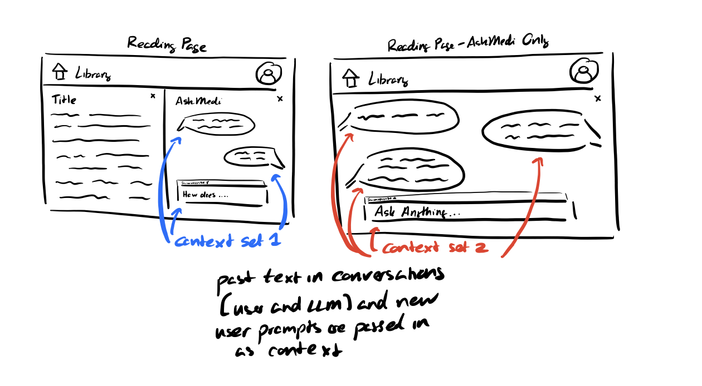
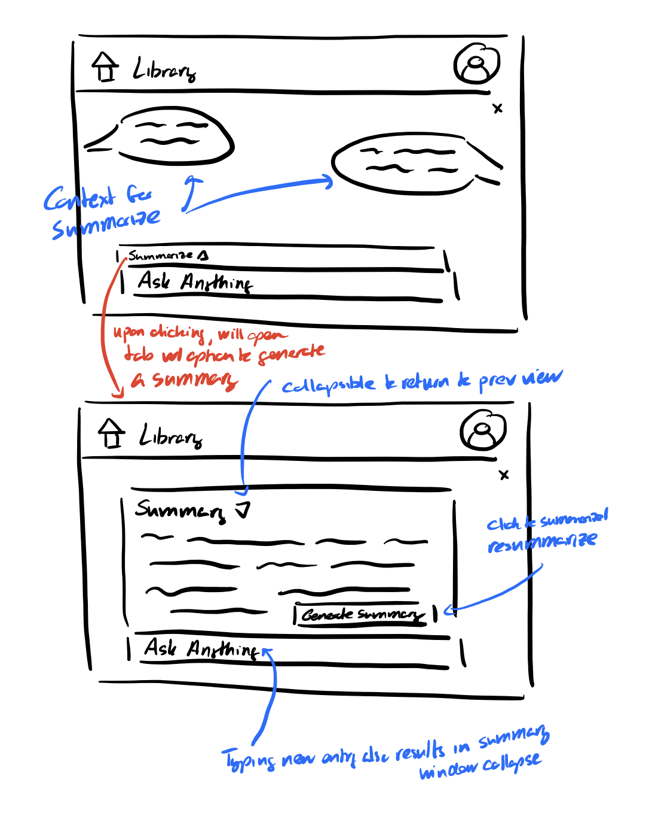

# User Journey

Ali decides to use AskMedi in order to summarize her paper while using MediLex. As she types questions, the system continuously passes her ongoing conversation and latest input to the LLM, so the assistant’s replies feel contextual and connected.

She continues chatting before deciding that she'd like to summarize what she's read. She opens the “Summarize" tab and clicks the "Generate Summary" button, which sends only the conversation history to the LLM with a summarization instruction. The collapsible summary panel opens with key points and decisions, giving her a quick overview. If the summary is useful, she simply collapses it and continues chatting; if not, she can regenerate it. This lightweight interaction makes the AI augmentation feel seamless and supportive, without disrupting her main task.

